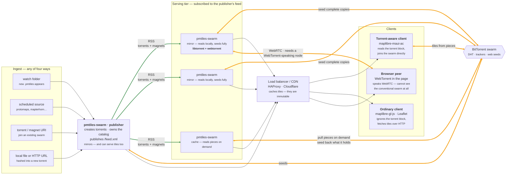
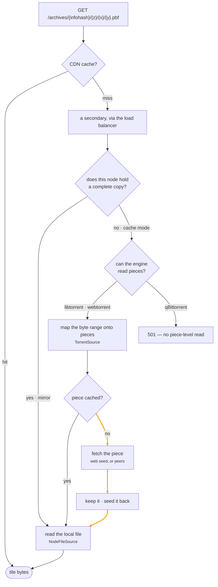
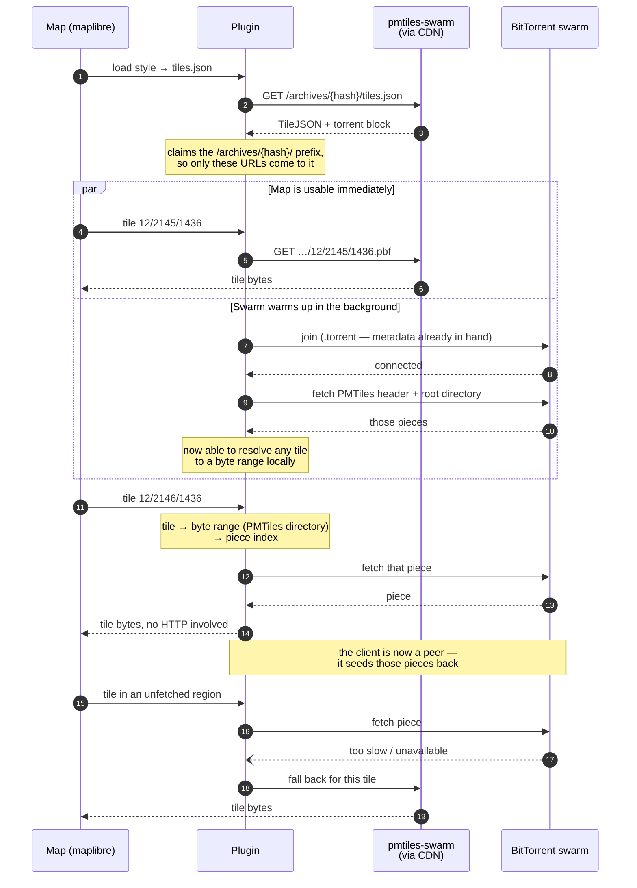
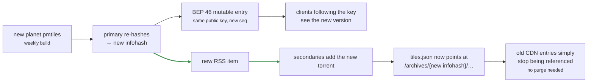

# Architecture Diagram — pmtiles-swarm

How a map library is ingested once, distributed over BitTorrent, and served to
both ordinary and torrent-aware clients from the same URLs.

Four views: **the whole topology**, **how a tile request resolves**, **what a
torrent-aware client does differently**, and **what happens when an archive is
updated**.
(Renders in VS Code's Markdown preview and on GitHub.)

---

## 1. Topology

One node publishes, any number serve, everything meets in the swarm.

**"Primary" and "secondary" are roles, not node types.** The only thing that makes
a node primary is that it creates torrents and owns the catalog others subscribe
to. It can sit in the load-balanced pool alongside everything else — it holds
complete copies, so it is the _best_ tile server in the fleet, not an exception
to it. The diagram separates them only to keep the arrows legible.

Likewise **mirror and cache are per-archive choices, not node identities.** A
serving node can mirror the archives it cares about and cache the rest. Mirroring
everything is a perfectly good deployment: every node seeds fully, every node
reads locally, and cache mode is there for the nodes and archives where a full
copy is not worth the disk.



**Key points:** **orange = BitTorrent, green = RSS distribution, plain = HTTP.**
The publisher is the only node that _creates_ torrents; the rest learn about
archives from its feed and join the swarm, each choosing per archive whether to
mirror it or cache it.

Every node is both a reader and a seeder. A mirror seeds the whole archive; a
cache-mode node seeds whatever pieces it has pulled to answer requests. Either
way serving load turns into swarm capacity rather than consuming it, which is the
inversion that makes this worth building.

**A browser cannot reach the swarm on its own.** Browsers speak WebRTC and
conventional clients speak TCP and uTP, and the two cannot see each other — so a
browser peer is only ever connected by a node running **WebTorrent**, which
speaks both. That is what `secondaryEngines: ["webtorrent"]` beside a libtorrent
primary buys: one node, one copy of the data, reachable from both halves of the
swarm. Nothing else about the topology changes, which is why only one node in the
diagram is labelled with its engines. See
[engines](engines.md#running-two-engines-at-once).

**It needs a `wss://` tracker to work**, and the defaults are UDP-only. A browser
has no UDP socket and no DHT, so a WebSocket tracker is its only route to finding
a peer — a torrent announcing only to UDP trackers is one no browser can join,
however many nodes are seeding it. That dashed half of the diagram is the piece
most likely to be quietly missing. See
[ports and reachability](engines.md#browser-peers-need-a-websocket-tracker-in-the-torrent).

The publisher is a single point of failure for **publishing new archives only**.
Once a torrent exists, the swarm and the serving tier keep working without it —
including the feed's existing items, which subscribers have already acted on.

---

## 2. How a tile request resolves

The same URL takes very different paths depending on who asks and what the
answering node holds.



**Key points:** a cold tile on a cache-mode node costs one piece fetch — and a
**web seed answers that in well under a second**, against 30+ seconds for a cold
swarm-only fetch. If your archives are also on plain HTTP storage, put that URL
in the torrent's `url-list`; it is the single biggest lever on this whole design.

A node holding a complete copy skips all of this and reads its local file.

---

## 3. What a torrent-aware client does

The server-side path above is what an _ordinary_ client triggers. A torrent-aware
client does something different: it takes over the archive reading itself, and
stops needing the tile endpoint at all.

The important part is that it does both at once — HTTP for the first paint, swarm
in the background — so there is never a blank map waiting for metadata.



**Key points:** the plugin resolves tiles the same way the server does — PMTiles
directory lookup, byte range, piece index — it just does it on the device. That
is why the `torrent` block carries the archive's `.torrent` rather than per-tile
URLs: **there is nothing tile-specific in the swarm.** The swarm holds one file,
and both ends know how to read tiles out of it.

Three consequences worth being clear about:

- **HTTP is never fully abandoned.** It is the fallback for anything the swarm
  cannot answer quickly, and the only path until the swarm is connected.
- **The client becomes a seeder.** Every piece it pulls, it serves — so a popular
  region gets _faster_ as more clients view it, which is the opposite of how a
  tile server behaves under load.
- **Prefer the `.torrent` over the magnet.** A magnet carries only an infohash, so
  the client must find peers and complete a metadata exchange before it knows
  anything about the archive — measured at 90 to 240 seconds against a 72 GiB
  archive. The `.torrent` served alongside the TileJSON already contains the
  metadata and is ready immediately.

---

## 4. Updating an archive

New data means a new infohash, which is what makes cache invalidation free.



**Key points:** tile URLs are content-addressed, so they never need invalidating.
The old infohash stays valid and servable for as long as anyone still holds it —
useful for clients pinned to a known-good build — while new requests move to the
new one as soon as they re-read `tiles.json`.

**There are exactly two mutable things**, and they say the same thing by
different means: the `/latest/<category>/` documents, which need this server, and
the BEP 46 record, which does not. A style pointing at the public key resolves
the current build over the DHT with nothing of ours running at all. Only the node
that builds signs those records — see
[security.md](security.md#the-publisher-key-is-not-a-credential), because the key
behaves unlike every other secret in the system.

The sequence number is derived from the clock rather than incremented, so a
publisher that is rebuilt or restored from backup carries on without needing to
remember where it had got to.

### Bootstrapping without the server

A torrent-aware client still has to _learn_ the magnet from somewhere, and until
it does, the swarm — the part that depends on no server — is unreachable
precisely when the server is down. The fix is that the magnet travels in the
**fragment** of the TileJSON URL a style already carries:

```
https://swarm.example.org/latest/openmaptiles/tiles.json#magnet:?xs=urn:btpk:…&s=openmaptiles&ws=…
```

A fragment is never sent in an HTTP request, so ordinary clients fetch the
TileJSON and ignore it while a swarm-aware one reads the magnet before making any
call. With a BEP 46 key in it (`xs=urn:btpk:`) rather than an infohash, that
string does not go stale on the next build either. See
[serving-tiles.md](serving-tiles.md#a-fragment-that-survives-a-rebuild).

---

## Deployment notes

**Decide how absolute URLs get built.** TileJSON and the RSS feed both contain
absolute URLs, and there are three ways to arrive at them:

| Config           | Behaviour                                                    | Use when                                     |
| ---------------- | ------------------------------------------------------------ | -------------------------------------------- |
| `publicUrl` set  | One canonical URL, whatever the request said                 | There is a single public name                |
| `trustProxy` set | Per request, from `X-Forwarded-Proto` and `X-Forwarded-Host` | One node answers on several names or schemes |
| neither          | From the connection itself                                   | Direct access, no proxy                      |

```json
{
  "trustProxy": "loopback, 10.0.0.0/8"
}
```

`trustProxy` is what lets a single node serve **both** `https://maps.example.org`
to the internet and `http://maps.internal` to the LAN, rewriting every published
URL to match how the request arrived. It takes anything Express accepts: `true`,
a hop count, or a subnet list. Prefer the subnet list — trusting these headers
from an untrusted client lets it claim any host it likes, and that host ends up
in documents you publish.

Behind a TLS-terminating proxy with neither option set, the node advertises
`http://` URLs, and a browser that loaded the map over `https` blocks every one
as mixed content — which looks like an empty map rather than a misconfiguration.

**Put the load balancer in front of the public port only.** A node can listen
twice: `port` serves tiles, TileJSON, the `.torrent` files and the feeds, and
`adminPort` serves the console and everything under `/api/`. With both set, the
public listener answers **404** for admin paths — not 403, because a refusal
confirms something is there to refuse. Routing is decided by the port the request
arrived on and never by a header, so nothing a proxy adds can move a request
between them.

```json
{
  "port": 8090,
  "adminPort": 8091,
  "adminHost": "127.0.0.1"
}
```

Bound to loopback like that, the thing that can rewrite configuration is
_unreachable_ rather than merely guarded, and the pool in front of the public
port carries no route to it at all. **Peer traffic never touches the balancer** —
neither BitTorrent nor WebRTC — so size it for tiles alone, and see
[ports and reachability](engines.md#ports-and-reachability) for the peer ports,
which are the only ones wanting a forwarding rule. Leave `adminPort` unset and both surfaces
share one listener, which is fine for a single machine and wrong for anything
behind a CDN. See [security](security.md).

**Load balancing needs no session affinity.** Any node serving a given infohash
returns byte-identical tiles, because the infohash pins the content. Round-robin
is fine, and a node can be added or removed mid-request-stream without a client
noticing.

**Cold start only applies to cache-mode nodes.** A node holding a complete copy
reads its local file and is fast from the first request. If every serving node
mirrors, this section does not apply to you at all.

Where nodes _do_ run in cache mode, each warms its own piece cache, so scattering
requests for one region across N nodes costs N first-fetches rather than one.
Three things reduce that, in order of effect:

1. **The CDN absorbs repeats.** Tiles are immutable, so the second request for a
   tile never reaches any node.
2. **The nodes are peers in the same swarm.** A node fetching a piece a sibling
   already holds gets it _from that sibling_, usually over the LAN. Local service
   discovery is on by default, so same-subnet nodes find each other without
   configuration. The cost is one external fetch plus N−1 local ones, not N
   external ones.
3. **Warm before rotating in.** `POST /api/torrents/{infohash}/warm` pre-fetches
   a region so the first real request is never the slow one. See
   [serving tiles](serving-tiles.md#warming-a-region).

Path-based affinity (HAProxy's `balance uri`) helps too, but it is the smallest
of the four levers and it costs you even load distribution.

**Size cache-mode disks for what gets viewed, not for the archive.** Cache usage
grows with what people actually look at and is not bounded on its own. Watch it,
and mirror instead where a full copy is affordable — a mirror is predictable,
faster, and a better peer.
