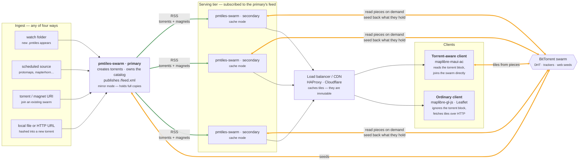
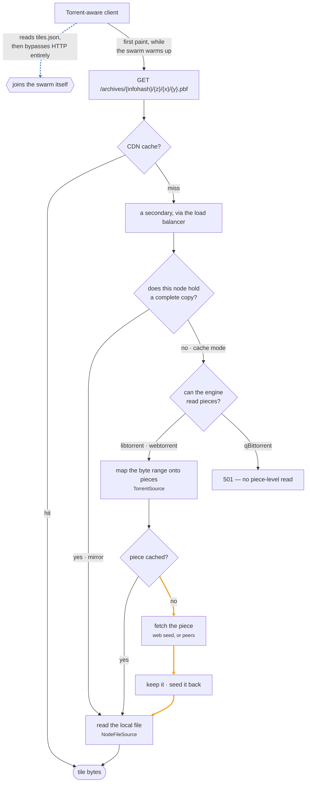
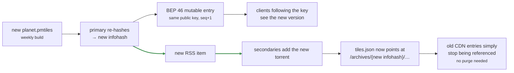

# Architecture Diagram — pmtiles-swarm

How a map library is ingested once, distributed over BitTorrent, and served to
both ordinary and torrent-aware clients from the same URLs.

Three views: **the whole topology**, **how a tile request resolves**, and **what
happens when an archive is updated**.
(Renders in VS Code's Markdown preview and on GitHub.)

---

## 1. Topology

One node publishes, several serve, everything meets in the swarm.



**Key points:** **orange = BitTorrent, green = RSS distribution, plain = HTTP.**
The primary is the only node that *creates* torrents; secondaries learn about
archives from its feed and join the swarm in cache mode, holding almost nothing.
Every node is both a reader and a seeder — a secondary that pulls pieces to
answer a tile request then serves those pieces to everyone else, so serving load
turns into swarm capacity rather than consuming it.

The primary is a single point of failure for **publishing new archives only**.
Once a torrent exists, the swarm and the serving tier keep working without it.

---

## 2. How a tile request resolves

The same URL takes very different paths depending on who asks and what the
answering node holds.



**Key points:** a cold tile on a cache-mode node costs one piece fetch — and a
**web seed answers that in well under a second**, against 30+ seconds for a cold
swarm-only fetch. If your archives are also on plain HTTP storage, put that URL
in the torrent's `url-list`; it is the single biggest lever on this whole design.

The torrent-aware client is the interesting case: it fetches over HTTP
immediately so the map paints, *and* joins the swarm in the background. Once the
swarm is warm it stops needing the HTTP path. It never has a blank screen waiting
for metadata.

---

## 3. Updating an archive

New data means a new infohash, which is what makes cache invalidation free.



**Key points:** tile URLs are content-addressed, so they never need invalidating.
The old infohash stays valid and servable for as long as anyone still holds it —
useful for clients pinned to a known-good build — while new requests move to the
new one as soon as they re-read `tiles.json`. The only mutable thing in the whole
system is that one document.

---

## Deployment notes

**Decide how absolute URLs get built.** TileJSON and the RSS feed both contain
absolute URLs, and there are three ways to arrive at them:

| Config | Behaviour | Use when |
| --- | --- | --- |
| `publicUrl` set | One canonical URL, whatever the request said | There is a single public name |
| `trustProxy` set | Per request, from `X-Forwarded-Proto` and `X-Forwarded-Host` | One node answers on several names or schemes |
| neither | From the connection itself | Direct access, no proxy |

```json
{
  "trustProxy": "loopback, 10.0.0.0/8"
}
```

`trustProxy` is what lets a single node serve **both** `https://maps.example.org`
to the internet and `http://maps.internal` to the LAN, rewriting every published
URL to match how the request arrived. It takes anything Express accepts: `true`,
a hop count, or a subnet list. Prefer the subnet list — trusting these headers
from an untrusted client lets it claim any host it likes, and that host ends up
in documents you publish.

Behind a TLS-terminating proxy with neither option set, the node advertises
`http://` URLs, and a browser that loaded the map over `https` blocks every one
as mixed content — which looks like an empty map rather than a misconfiguration.

**Load balancing needs no session affinity.** Any node serving a given infohash
returns byte-identical tiles, because the infohash pins the content. Round-robin
is fine.

**But affinity still helps.** Each secondary warms its piece cache independently,
so scattering requests for one region across N nodes costs N cold fetches instead
of one. Hashing on the request path rather than the client address keeps a given
tile landing on the same node. The CDN in front absorbs most of this either way.

**Give secondaries enough disk for what gets viewed, not for the archive.** Cache
mode grows with what people actually look at. Watch it and cap it; it is not
bounded on its own.
